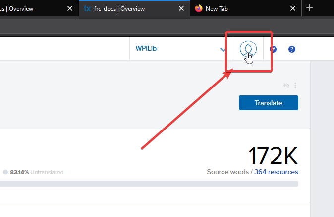
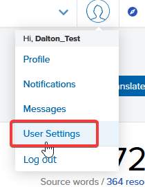
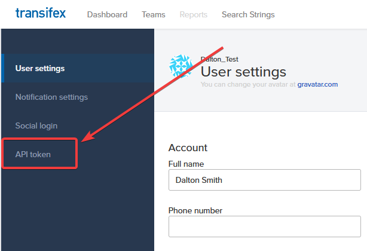
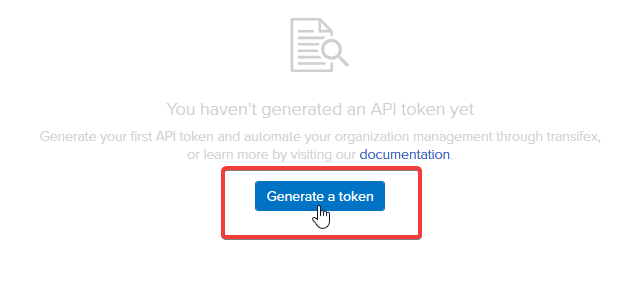
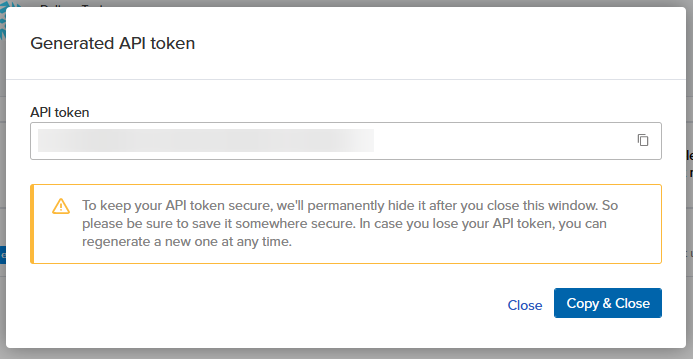

# frc-docs-translations
This is the central repository that RTD points toward to view translations.

## Interested in Translating?

Please visit the translation guide [here](https://docs.wpilib.org/en/latest/docs/contributing/frc-docs/translations.html)

## Building Locally

**Please note:** Python 3.6 or higher is required to build this documentation

First, clone this repo using the follwowing command

- ``git clone --recurse-submodules https://github.com/wpilibsuite/frc-docs-translations.git``

and ensure that all requirements are up-to-date by running

- ``pip install -r frc-docs/source/requirements.txt``

Translated documents can be built by running 

- ``sphinx-build -D language=LANG -b html . _build/html``

where ``LANG`` is the locale code of your language. You can view a list of supported locales, by checking the ``locale`` directory.

## Updating Translations

### Grabbing your API Key

Updating translations locally requires a Transifex API key. To get started, select your avatar in the top right of the transifex dashboard.



Then select "User settings"



Then select the "API token" option in the lefthand menu.



Now press the "Generate a token" button



This will bring up a screen containing your API key. Write this down and save it.



### Pulling from Transifex

**Important:** Make sure you have all [dependencies](https://docs.wpilib.org/en/latest/docs/contributing/frc-docs/build-instructions.html) installed. 

The first step is to generate all translatable files from Sphinx. This can be done with the ``gettext`` builder. Type the below command to generate translatable POT files.

```
sphinx-build -T -b gettext frc-docs/source locale/pot
```

Then run 
Go ahead and run the below command to save your transifex token to the python transifex client, replacing the dummy token below with the one you copied earlier.

```
tx init --force-save --no-interactive --token 1/397c068682be925a9d47be1922f050c37b654d3e
```

and now we need to grab a list of currently used resources (and their slugs) to grab from transifex. Go ahead and run the command below to do that.

```
sphinx-intl update-txconfig-resources -p locale/pot -d locale --transifex-project-name frc-docs
```

In the translation project directory, the below command can be used to grab all reviewed French (Canada) translations.

```
tx pull -l fr_CA --mode onlyreviewed --use-git-timestamps
```

You can replace ``fr_CA`` with the language code that you want to pull from transifex.
